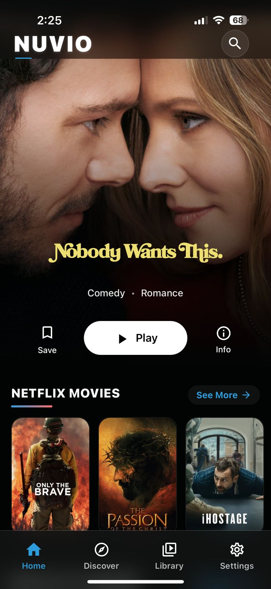
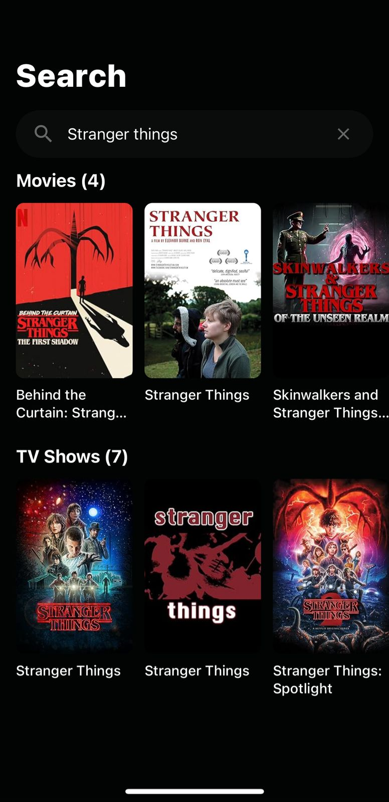
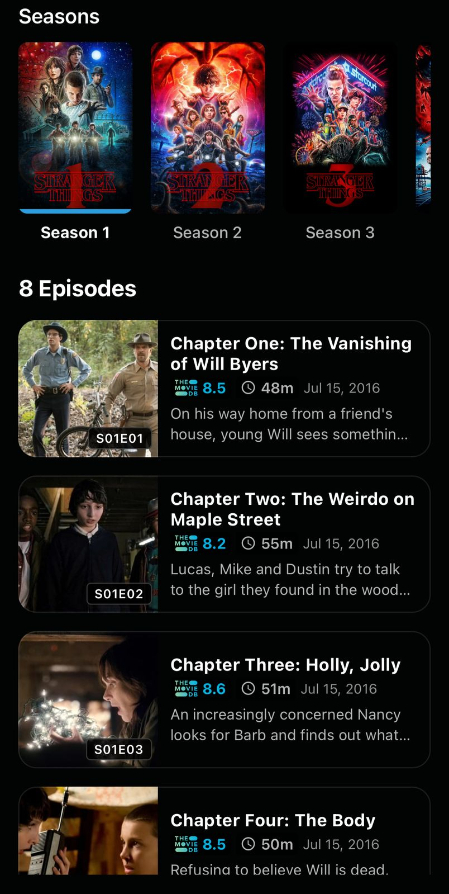

# Nuvio - Streaming App

Nuvio is an Open-Source cross-platform streaming application built with React Native and Expo, allowing users to browse, discover, and watch video content.

## ✨ Features

*   **Home Screen:** Customizable dashboard featuring highlighted content, continue watching section, and access to various content catalogs.
*   **Content Discovery:** Explore trending, popular, or categorized movies and TV shows.
*   **Detailed Metadata:** Access comprehensive information for content, including descriptions, cast, crew, and ratings.
*   **Catalog Browsing:** Navigate through specific genres, curated lists, or addon-provided catalogs.
*   **Video Playback:** Integrated video player for watching content.
*   **Stream Selection:** Choose from available video streams provided by configured sources/addons.
*   **Search Functionality:** Search for specific movies, TV shows, or other content.
*   **Personal Library:** Manage a collection of favorite movies and shows.
*   **Trakt.tv Integration:** Sync watch history, collection, and watch progress with your Trakt account.
*   **Addon Management:** Install, manage, and reorder addons compatible with the Stremio addon protocol to source content streams and catalogs.
*   **Release Calendar:** View upcoming movie releases or TV show episode air dates.
*   **Extensive Settings:**
    *   Player customization (e.g., subtitle preferences).
    *   Content source configuration (TMDB API keys, MDBList URLs).
    *   Catalog management and visibility.
    *   Trakt account connection.
    *   Notification preferences.
    *   Home screen layout adjustments.
*   **Optimized & Interactive UI:** Smooth browsing with skeleton loaders, pull-to-refresh, performant lists, haptic feedback, and action menus.
*   **Cross-Platform:** Runs on iOS and Android (highly optimized for iOS; Android performance is generally good).

## 📸 Screenshots

| Home                                       | Discover                                   | Search                                   |
| :----------------------------------------- | :----------------------------------------- | :--------------------------------------- |
|                |        |          |
| **Metadata**                               | **Seasons & Episodes**                     | **Rating**                               |
|    | |    |

## 🚀 Tech Stack

*   **Framework:** React Native (v0.76.9) with Expo (SDK 52)
*   **Language:** TypeScript
*   **Navigation:** React Navigation (v7)
*   **Video Playback:** `react-native-video`
*   **UI Components:** `react-native-paper`, `@gorhom/bottom-sheet`, `@shopify/flash-list`
*   **State Management/Async:** Context API, `axios`
*   **Animations & Gestures:** `react-native-reanimated`, `react-native-gesture-handler`
*   **Data Sources (Inferred):** TMDB (The Movie Database), potentially Stremio-related services

## 🛠️ Setup & Running

1.  **Prerequisites:**
    *   Node.js (LTS recommended)
    *   npm or yarn
    *   Expo Go app on your device/simulator (for development) or setup for native builds (Android Studio/Xcode).

2.  **Clone the repository:**
    ```bash
    git clone https://github.com/nayifleo1/NuvioExpo.git
    cd nuvio 
    ```

3.  **Install dependencies:**
    ```bash
    npm install
    # or
    yarn install
    ```

4.  **Run the application:**

    *   **For Expo Go (Development):**
        ```bash
        npm start 
        # or
        yarn start
        ```
        Scan the QR code with the Expo Go app on your iOS or Android device.

    *   **For Native Android Build/Emulator:**
        ```bash
        npm run android
        # or
        yarn android
        ```

    *   **For Native iOS Build/Simulator:**
        ```bash
        npm run ios
        # or
        yarn ios
        ```

## 🤝 Contributing

Contributions are welcome! If you'd like to contribute, please follow these general steps:

1.  Fork the repository.
2.  Create a new branch for your feature or bug fix (`git checkout -b feature/your-feature-name` or `bugfix/issue-number`).
3.  Make your changes and commit them with descriptive messages.
4.  Push your branch to your fork (`git push origin feature/your-feature-name`).
5.  Open a Pull Request to the main repository's `main` or `develop` branch (please check which branch is used for development).

Please ensure your code follows the project's coding style and includes tests where applicable.

## 🐛 Reporting Issues

If you encounter any bugs or have suggestions, please open an issue on the GitHub repository. Provide as much detail as possible, including:

*   Steps to reproduce the issue.
*   Expected behavior.
*   Actual behavior.
*   Screenshots or logs, if helpful.
*   Your environment (OS, device, app version).

## 🙏 Acknowledgements

Huge thanks to the Stremio team for their pioneering work in the streaming space and for creating their addon protocol/system. As an indie developer, their approach has been a major source of inspiration. This project utilizes compatibility with the Stremio addon ecosystem to source content.

## 📄 License

This project is licensed under the MIT License. See the [LICENSE](LICENSE) file for details. 